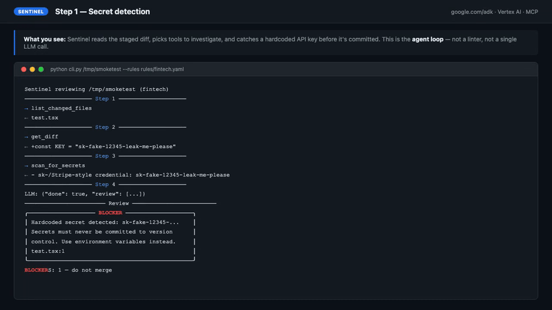

# Sentinel

[](LICENSE)
[](https://www.python.org/)
[](https://google.github.io/adk-docs/)
[](https://deepmind.google/technologies/gemini/)

**Landing:** [mugeshgithub.github.io/sentinel](https://mugeshgithub.github.io/sentinel/) · **Feedback:** [open an issue](https://github.com/Mugeshgithub/sentinel/issues/new)

**Domain-aware AI code reviewer. Open engine, vertical rule packs.**

I pushed to production every day with no reviewer and no test suite. Last quarter that cost me — wrong prices, dead API links, missing filters. All shipped to real users.

Sentinel is what I built to fix that. It reviews your git diff against rules you write in plain English, and blocks the commit before the bug ships.

---

## Demo



> [Watch the full 2-minute demo](https://www.linkedin.com/posts/mugesh-mdeveloper_googleforstartupsaiagentchallenge-buildinpublic-ugcPost-7456086587337175040-YYMJ)

---

## The problem

Generic linters catch style. They don't catch:

- Dead API routes still referenced after a backend is removed
- Symbol format mismatches that silently show $0 prices
- Tile and drawer components fetching from different data sources
- Missing query parameters returning unfiltered global data
- Unfiltered market data surfacing penny stocks instead of NVDA, AAPL, TSLA

These are real production bugs. They cost hours to debug and trust to repair.

---

## How it works

Sentinel is an **agent**, not a linter. It investigates:

```
You: git commit -m "fix movers sort"
Sentinel: list_changed_files → get_diff → read_file → search_codebase → done

🔴 BLOCKER TopMoversWidget.tsx:52
Manual .replace('-USD','') detected. Use toSymbol() from
lib/api/market-data.ts to avoid $0 price bugs from symbol
format mismatches.

🔴 BLOCKER app/api/market/leaders/route.ts:20
Direct call to external market data API detected. Use apiFetch()
from lib/api/market-data.ts for centralized key management and
rate limiting.

BLOCKERS: 2 — commit rejected.
```

The LLM picks tools, investigates, and reasons — it doesn't just pattern-match. That's the difference between a linter and an agent.

---

## Architecture

```
Engine (this repo)       Rule Pack (per domain)
──────────────────       ──────────────────────
cli.py                   rules/fintech.yaml      ← generic, open source
engine/agent.py  ←────── .sentinel/rules.yaml   ← your project config
engine/tools.py
engine/github_mcp.py
engine/mcp_tools.py
```

- **Engine** — universal, open source (this repo)
- **Rule packs** — domain-specific YAML (fintech, healthcare, …)
- **Project config** — extends a rule pack with your own conventions

Rule packs are **natural language**, not regex:

```yaml
- id: symbol-normalization
  severity: BLOCKER
  when: |
    Any code path passes a symbol string to a market data API call
    without going through the canonical toSymbol() helper.
    Manual string replacement (.replace('-USD',''), ${ticker}USD)
    is a strong signal.
  why: |
    Symbol format mismatches silently show $0 prices to users.
    The data provider returns one format; the app assumes another.
    One missing normalization call = broken prices for every user of that asset.
```

The LLM interprets the rule against the diff. No regex engine needed.

---

## Eval results

Sentinel tested against 3 historical production bugs from a live fintech SaaS:

```
[PASS] penny-stocks-in-movers      matched: unfiltered-market-data, manual-symbol-conversion
[PASS] research-tile-global-feed   matched: incomplete-api-params, tile-drawer-data-source
[PASS] legacy-provider-dead-refs   matched: dead-endpoint-references
SCORE: 3 / 3
```

---

## Tech stack

| Component       | Technology                              |
| --------------- | --------------------------------------- |
| Agent framework | Google ADK 1.31.1                       |
| Model           | Gemini 2.5 Flash (Vertex AI)            |
| MCP integration | `@modelcontextprotocol/server-github`   |
| Rule format     | Natural language YAML                   |
| CLI             | Python 3.10, Rich                       |
| Cloud           | Google Cloud (Vertex AI)                |

---

## Install

```bash
git clone https://github.com/Mugeshgithub/sentinel
cd sentinel
python3 -m venv venv && source venv/bin/activate
pip install -e .

export GEMINI_API_KEY="your_key"   # from aistudio.google.com
export GITHUB_PAT="ghp_..."        # for --pr mode
```

---

## Usage

**Three commands and you're protected.**

```bash
# 1. Create a rules file in your repo (choose fintech or healthcare)
sentinel init /path/to/your/repo --domain fintech

# 2. Install the pre-commit hook — runs automatically on every commit
sentinel hook /path/to/your/repo

# 3. Or run a manual review any time
sentinel review /path/to/your/repo
```

After `sentinel hook`, every `git commit` runs Sentinel automatically. BLOCKER findings reject the commit. Use `git commit --no-verify` to bypass.

**Review a GitHub PR (posts inline comments)**

```bash
sentinel review --pr https://github.com/your-org/your-repo/pull/42 \
                --rules /path/to/your/repo/.sentinel/rules.yaml
```

---

## Write your own rule pack

`sentinel init` creates `.sentinel/rules.yaml` for you. Open it and add your rules:

```yaml
extends: fintech          # inherit generic fintech rules (or: healthcare)
domain: my-app

rules:
  - id: my-custom-rule
    severity: BLOCKER     # BLOCKER | RISKY | NIT
    when: |
      Describe when this rule fires in plain English.
      The LLM interprets this against the diff.
    unless: |
      Describe exceptions (optional).
    why: |
      Why this matters. Include a real past incident if you have one.
```

---

## Roadmap

- [x] Fintech rule pack (`rules/fintech.yaml`)
- [x] Healthcare rule pack (`rules/healthcare.yaml`)
- [ ] E-commerce rule pack
- [ ] Rule pack marketplace (Google Cloud Marketplace)
- [ ] VS Code extension
- [ ] Dashboard — review history, rule hit stats

---

## License

MIT — engine is open source. Rule packs are open source. Build your own.

---

*Built for the [Google for Startups AI Agent Challenge](https://cloud.google.com/blog/topics/startups/google-for-startups-ai-agent-challenge) — Track 1 (Build) + Track 3 (Marketplace). EMEA, Paris.*
